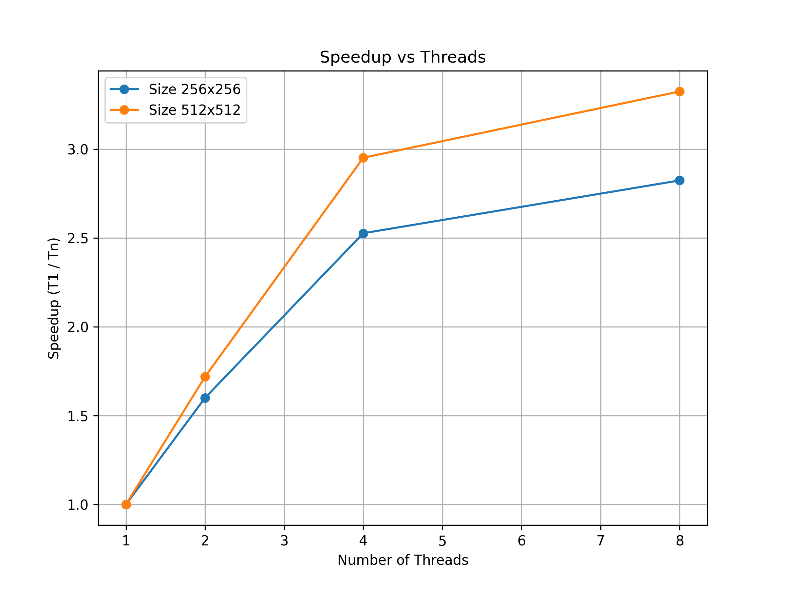
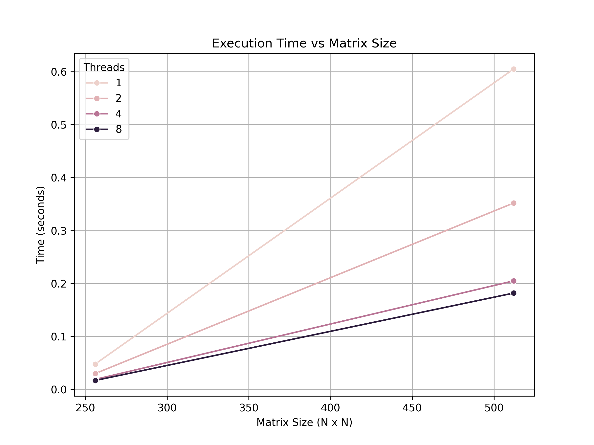

# V0 ->HPC Matrix Multiplication with OpenMP

## Overview
- What is matrix multiplication?
- Why parallelism is important (multi-core speedup).

## Project Structure
- `src/` : C++ code (sequential + OpenMP)
- `data/` : CSV benchmark results
- `plots/` : Execution time & speedup plots
- `results.py` : Python script to generate plots


## Installation & Compilation
1. Install GCC with OpenMP:
   ```bash
   sudo apt install g++

 # Compile the sequential code: 
 
2.g++ src/matrix_mul.cpp -o matrix_mul_seq -O2
./matrix_mul
# compile the openMP parallel version:
g++ src/matrix_mul_omp.cpp -o matrix_mul_omp -fopenmp -O2
./matrix_mul_omp > data/results.csv

# Results-> ,
# Future scope for V1:
=>Test larger matrices (1024, 2048, 4096)

=>Implement cache optimization / blocked matrix multiplication

=>Add MPI version for multi-node HPC

